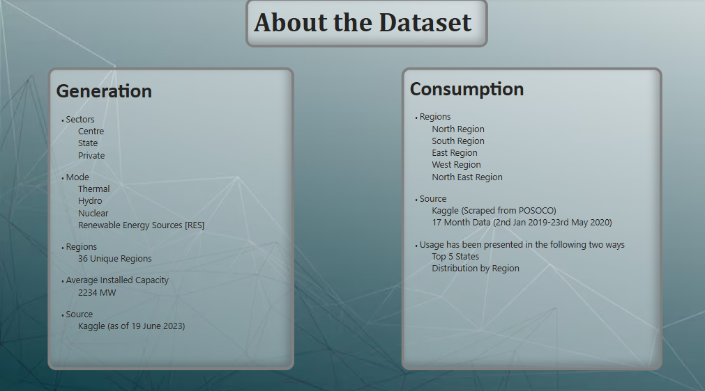
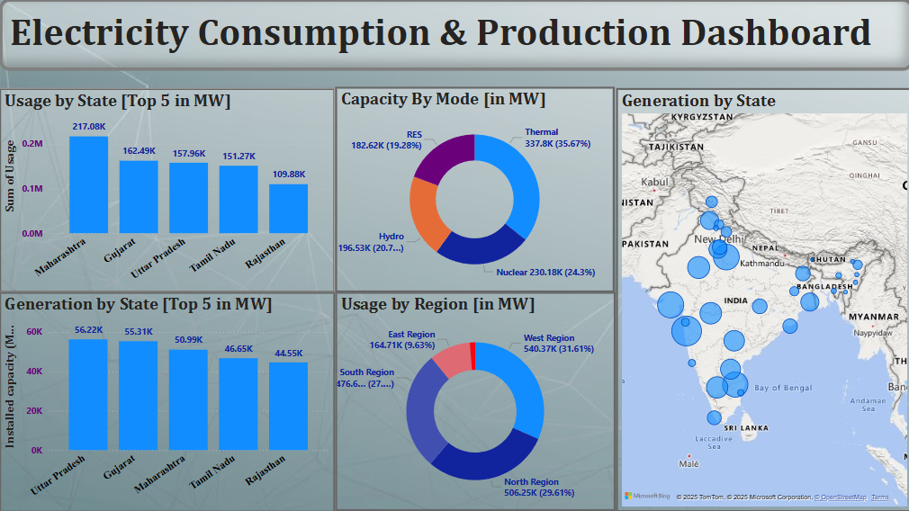
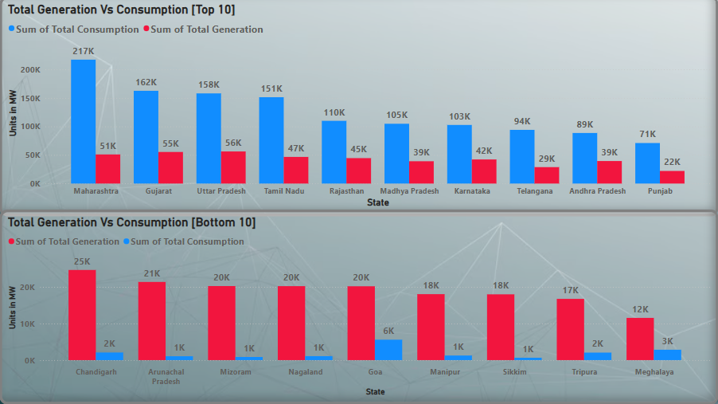

# ⚡ Electricity Consumption & Production Dashboard – India

---

## 🧠 Overview
This project analyses **electricity generation and consumption** across Indian states and regions using two Kaggle datasets.  
It highlights production efficiency, consumption patterns, and regional gaps to inform data-driven energy insights.

---

## 🚀 Project Objective
To create an **interactive Power BI dashboard** that visualises electricity generation and consumption, enabling insights into **state-wise production, regional consumption, and infrastructure priorities**.

---

## 📊 Datasets
1. **Generation Dataset:**  
   - Covers Centre, State, and Private sectors  
   - Includes Thermal, Hydro, Nuclear, and Renewable Energy sources  
   - 36 regions, total capacity 234 MW (as of 19 June 2023)

2. **Consumption Dataset:**  
   - Data from POSOCO (2 Jan 2019 – 23 May 2020)  
   - North, South, East, West, North-East regions  
   - Focus on top 5 states by consumption

**Challenge:** Mismatched timelines made consumption appear higher than generation; separate insights were still valuable.

---

## 🛠️ Data Cleaning & Modelling
- Handled timeline mismatches for accurate comparisons  
- Used **Power Query** for joining, summarising, and transforming datasets  
- Standardized state and region names for consistency

---

## 📈 Dashboard Highlights
- **Generation:** Gujarat leads (mostly Thermal); Meghalaya, Assam, and Delhi lag  
- **Consumption:** Maharashtra tops, followed by Gujarat and Uttar Pradesh; West Region consumes the most  
- **Generation vs Consumption:** Gujarat and Maharashtra are both high producers and high consumers, suggesting population/lifestyle impact

**Key Takeaways:**  
- Top generation states: Gujarat, Maharashtra, Tamil Nadu, Rajasthan, Karnataka  
- West Region requires more generation to meet demand  
- States like Meghalaya and Assam need infrastructure investment to improve contribution

---

## 🛠️ Tools Used
- **Power BI:** Data visualisation and dashboard building  
- **Power Query:** Data modelling and transformation  
- **Excel / CSV:** Initial data cleaning and preparation

---

## 💡 Key Learnings
- Working with imperfect datasets and adapting to mismatched timelines  
- Power Query skills for data modelling  
- Translating raw data into **actionable insights** using visual analytics

---

## 📸 Dashboard Preview
*(Upload your Power BI dashboard screenshot here once added)*  

---

